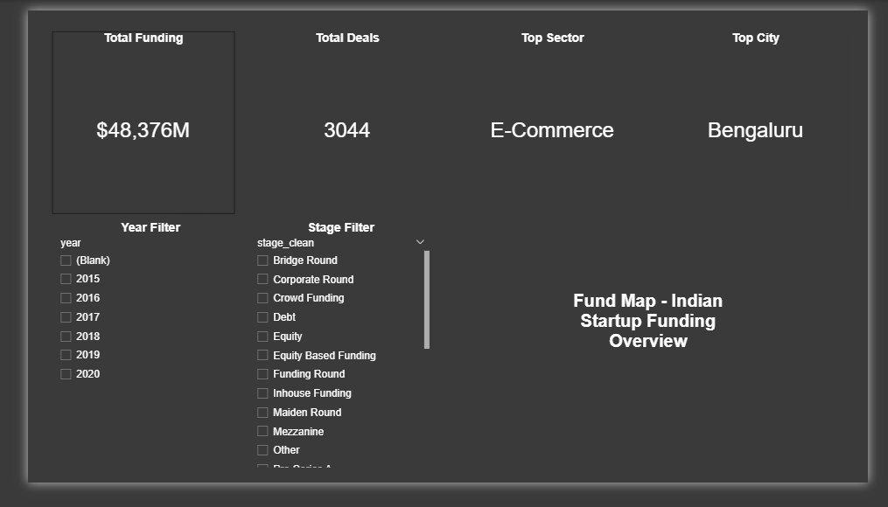
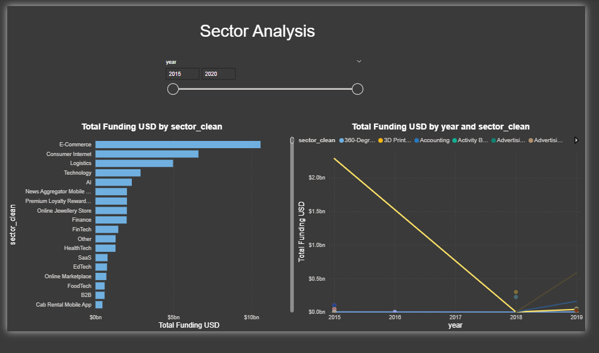
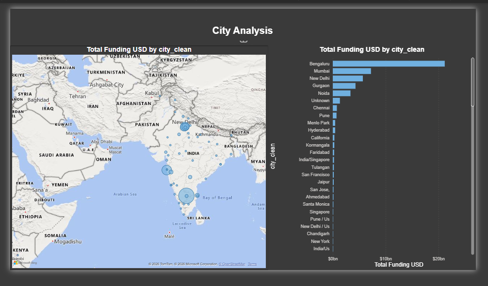
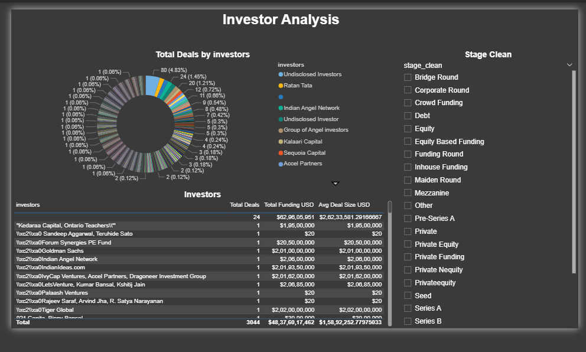
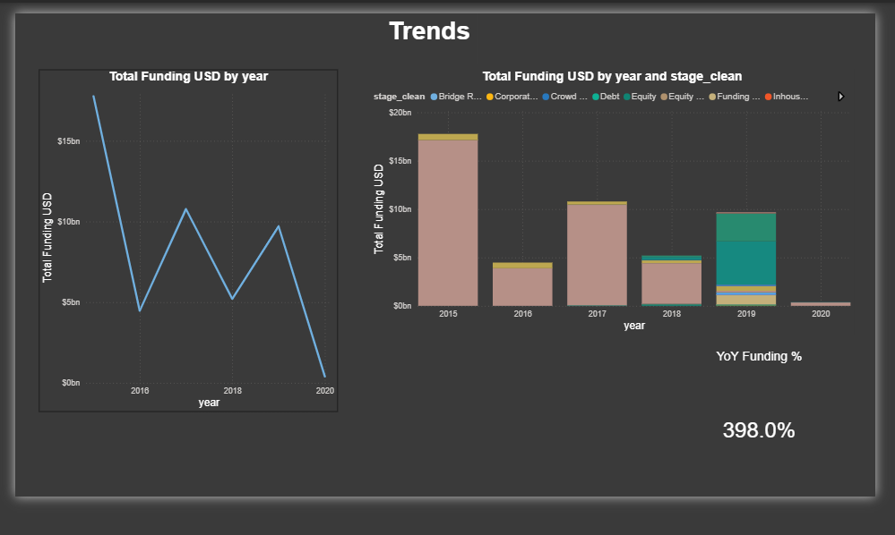

# FundMap: Indian Startup Funding Analysis

End-to-end data analyst portfolio project using Python, SQL, Jupyter, and Power BI.

## Project Goal
Analyze Indian startup funding patterns, identify sector/city/investor trends, and present business-ready insights through SQL analysis and an interactive 5-page Power BI dashboard.

## Dataset
- Source: Kaggle, Indian Startup Funding dataset
- Raw file: Dataset/startup_funding.csv
- Cleaned file: Dataset/startup_funding_cleaned.csv
- Current available period in source file: 2015 to 2020

## Tech Stack
- Python: pandas, numpy, matplotlib, seaborn
- SQL: MySQL-style analysis queries (plus DuckDB runner for local execution)
- Notebook: Jupyter for EDA and chart insights
- BI: Power BI Desktop for final dashboard

## Key Deliverables
- Data cleaning pipeline with practical standardization logic
- SQL analysis queries for core business questions
- EDA notebook with visual storytelling
- Power BI dashboard with 5 pages
- Project assets prepared for GitHub portfolio publishing

## Cleaning Work Performed
- Missing funding amounts handled with sector-median imputation, then global-median fallback
- City normalization (example: Bombay to Mumbai, Bangalore to Bengaluru)
- Sector normalization (FinTech naming variants mapped to canonical labels)
- Funding values converted into unified numeric USD columns
- Funding stages standardized into consistent groups (Seed, Series A, Series B+, Private Equity, Debt, Other)
- Text artifact cleanup added for escaped characters and non-breaking-space issues

## SQL Questions Covered
1. Top 10 sectors by total funding
2. Top 10 cities by total funding
3. Year-over-year funding growth by sector
4. Average deal size by funding stage
5. Top 10 most active investors by deal count
6. Sector with the highest average deal size

## Headline Findings
- Total tracked funding: USD 48.34B
- Total deals analyzed: 3,036
- Highest funded sector: E-Commerce (USD 10.59B)
- Highest funded city: Bengaluru (USD 21.17B)
- E-Commerce plus Consumer Internet share: 35.6 percent of total funding
- Bengaluru plus Mumbai share: 46.3 percent of all deals

## Repository Structure
- Dataset/
  - startup_funding.csv
  - startup_funding_cleaned.csv
- scripts/
  - clean_funding_data.py
  - run_sql_duckdb.py
- sql/
  - schema_mysql.sql
  - analysis_queries.sql
- notebooks/
  - FundMap_Analysis.ipynb
- outputs/
  - sql_duckdb/ (query outputs)
- powerbi/
  - FundMap.pbix
  - dashboard_plan.md
  - POWERBI_BEGINNER_GUIDE.md
  - Screenshot/

## How To Reproduce
1. Install dependencies

   pip install -r requirements.txt

2. Generate cleaned data

   python scripts/clean_funding_data.py

3. Run SQL analysis locally via DuckDB

   python scripts/run_sql_duckdb.py

4. Optional: run MySQL scripts
   - sql/schema_mysql.sql
   - sql/analysis_queries.sql

5. Open notebook for EDA
   - notebooks/FundMap_Analysis.ipynb

6. Open Power BI report
   - powerbi/FundMap.pbix

## Power BI Dashboard Pages
1. Overview: KPIs for funding, deals, top sector, top city
2. Sector Analysis: funding by sector and year trend
3. City Analysis: map plus top cities by funding
4. Investor Analysis: investor activity and summary table
5. Trends: annual funding and funding-stage breakdown

## Dashboard Screenshots
### 1. Overview

### 2. Sector Analysis

### 3. City Analysis

### 4. Investor Analysis

### 5. Trends

## Why This Project Is Resume-Ready
- Demonstrates analyst thinking through non-trivial cleaning decisions
- Shows SQL competency with aggregations, CTEs, and trend logic
- Shows data storytelling with notebook visuals and insights
- Shows BI communication ability through an executive-style dashboard

## Author
Jay Joshi

Email: joshijayy421@gmail.com

Phone: +91 8875549960

LinkedIn: https://www.linkedin.com/in/jay-joshi-75b75124b/

GitHub: https://github.com/jayyx3

Portfolio: https://jay-portfolio-ten-tawny.vercel.app/
